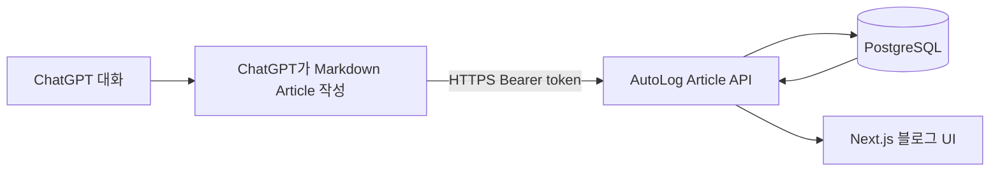

# AutoLog — 대화에서 만드는 개인 기술 블로그 / 지식 베이스

평소 ChatGPT와 나눈 작업·장애 해결·학습 대화를 완성된 Markdown 기술 글로 저장하고 읽는다.
핵심 데이터는 Article.content_markdown이다. 백엔드는 글을 검증·저장하며 OpenAI를 다시 호출하지 않는다.

글 목록, 카테고리·태그·상태 필터, 제목/요약/본문 검색, Markdown 상세 페이지와 코드 블록,
관련 글과 작성일/수정일을 공개한다. **published는 로그인 없이 읽을 수 있고 draft는 관리자만 읽는다.**
`/login`에서 로그인한 관리자는 `/admin`에서 작성·수정·삭제·발행 상태를 관리한다.
[공개 블로그와 관리자 CMS 권한·배포 절차](docs/public-cms.md)를 참고한다.

[ChatGPT Action 연동](docs/chatgpt-actions.md), [아키텍처](docs/architecture.md),
[검증 기록](docs/verification.md), [NFS 블로그 요청 예제](docs/examples/nfs-article.json)를 참고한다.

## Article API와 기존 글 이어쓰기

공개 GET은 published 글만 반환한다. 목록의 `status=draft`, draft 상세, 이전 Entry 조회는 관리자 세션이 필요하다.
쓰기 API는 관리자 HttpOnly 세션 또는 `Authorization: Bearer <API_TOKEN>`을 요구한다.
API Token은 쓰기 전용이며 draft 읽기 권한을 부여하지 않는다. Frontend에는 API Token을 주입하지 않는다.

| 메서드 | 경로 | 용도 |
| --- | --- | --- |
| POST | /api/articles | 새 Markdown 글 생성 (201), 중복 slug는 409 |
| POST | /api/articles/upsert | 같은 slug 또는 target_article_id 갱신, 신규 201 / 갱신 200 |
| GET | /api/articles | q, slug, category_id, tag, status, limit, offset 검색·필터 |
| GET | /api/articles/{id} | 전체 Markdown과 관련 글 ID 조회 |
| PATCH | /api/articles/{id} | 부분 수정, expected_updated_at으로 충돌 검사 |
| DELETE | /api/articles/{id} | 삭제 및 관련 링크 정리 |
| GET | /api/categories | 기존 카테고리 목록 (Entry와 공유) |
| GET | /api/tags | Article에 사용된 태그 목록 |
| GET | /openapi-action.json | 공개 Article Action schema |

ChatGPT는 저장 전에 `/api/categories`와 `/api/articles?q=주제`를 조회한다.
같은 주제로 판단한 글이 있으면 상세를 읽고 기존 ID를 `target_article_id`로 지정한다.
서버의 매칭은 **동일 slug 또는 명시적 ID**이며 의미 유사도를 자동 추측하지 않는다.
새 주제는 안정적인 slug로 upsert한다. `mode=replace`는 완성된 본문 교체,
`mode=append`는 기존 본문 뒤에 구분선과 새 Markdown을 추가한다.
append는 태그와 관련 글을 합치며, 기존 글에서 생략한 선택 메타데이터는 보존한다.
`expected_updated_at`을 상세 조회의 값으로 보내면 동시 수정 시 409로 차단한다.
생략한 replace는 마지막 요청의 내용을 적용하므로 기존 글 갱신에는 버전 값을 권장한다.

## 기존 설치에서 전환

`0002_articles` migration은 Article·관련 링크 테이블만 추가하고 Entry/Category를 보존한다.
기존 Entry API와 ingest API는 유지되며 이전 UI는 `/legacy`에서 사용할 수 있다.
짧은 Entry를 완성된 기술 글로 자동 변환하지 않는다. 필요한 내용은 ChatGPT로 글을 작성해 옮긴다.

개발: 새 이미지 빌드 후 `docker compose up -d --wait`를 실행하면 migration이 먼저 적용된다.
운영: 아래 업데이트 순서대로 새 backend 이미지의 migration Job 완료 후 API/UI를 rollout한다.
Namespace, PostgreSQL volume이나 PVC를 삭제하지 않는다.

운영: **Ubuntu VM 3대 / Kubernetes / containerd / Cilium**, 이미지 빌드: **Podman**.
Docker Compose는 개발·통합 테스트 전용이다. Kubernetes 노드에 Docker daemon을 설치하지 않는다.

## 구성과 환경변수

- frontend/Dockerfile: Next.js standalone 다단계 production 이미지, 비루트 실행.
- backend/Dockerfile: FastAPI production 이미지, 고정 의존성·해시 검증, 비루트 실행.
- k8s/platform, database, migration, backend, frontend, networking, ingress: 순서별 매니페스트.
- scripts/build-images.sh: Podman build/tag/push.
- scripts/render-k8s.py: GHCR 이미지, PVC/emptyDir, NodePort/Ingress 선택을 적용한 YAML 생성.
- k8s/examples: Secret 구조와 기본 StorageClass 없는 환경의 local PV 예시.

브라우저 → Frontend NodePort(30080) → Next.js 서버 /api 프록시 → Backend ClusterIP → PostgreSQL.
ChatGPT → HTTPS frontend `/api/articles` 또는 `/api/articles/upsert` → Bearer 검증 → Backend → PostgreSQL.
웹 로그인은 backend가 서명한 8시간 HttpOnly/SameSite=Strict 쿠키를 사용한다.
Next.js는 관리자 세션 쿠키 또는 외부 클라이언트의 Bearer 헤더를 전달하며 API Token을 만들거나 주입하지 않는다.
열린 UI는 외부 저장을 3초마다 확인하고 창/탭 복귀 시에도 새로 조회한다.
토큰/로그인 설정이 빠지면 해당 보호 경로는 닫힌다. 공개 글·검색·published 카테고리/태그·health·Action schema는 공개한다.
선택적 OpenAI 분류는 이전 `/legacy` Entry 기능에만 적용한다. Article API는 이 설정과 관계없이 OpenAI를 호출하지 않는다.

| 변수 | 주입 대상 | 저장 위치 |
| --- | --- | --- |
| DATABASE_URL | backend, migration | lifelog-db Secret |
| POSTGRES_PASSWORD | PostgreSQL | lifelog-db Secret |
| POSTGRES_DB, POSTGRES_USER | PostgreSQL | ConfigMap (기본 lifelog) |
| OPENAI_API_KEY | backend만 | lifelog-openai Secret |
| OPENAI_MODEL | backend | ConfigMap (기본 gpt-4o-mini) |
| ENABLE_OPENAI_CLASSIFICATION | backend | ConfigMap (기본 false) |
| API_TOKEN | backend만 | lifelog-api Secret, 32자 이상 무작위 토큰 |
| ACTION_SERVER_URL | backend | ConfigMap, 외부 HTTPS URL |
| BACKEND_URL | frontend 서버 | ConfigMap (http://lifelog-backend:8000) |
| APP_USERNAME, APP_PASSWORD | backend만 | lifelog-app Secret |
| CORS_ORIGINS | backend | ConfigMap, JSON 배열 |

키와 비밀번호를 YAML, Git, 이미지, NEXT_PUBLIC 변수에 넣지 않는다. .env.example의 빈 값은
보안 설정으로 채우며 실제 .env는 Git에서 제외한다. Kubernetes는 .env를 읽지 않고 Secret/ConfigMap을 쓴다.
OpenAI Secret은 기본 운영에서 생략한다. 블로그·Article 저장·조회·수정·삭제에는 필요하지 않다.
서버 AI 분류가 필요하면 Secret과 `ENABLE_OPENAI_CLASSIFICATION=true`를 함께 설정한다.

## 1. 클러스터 확인

관리용 kubeconfig를 가진 호스트의 저장소 루트에서 실행한다. kubectl 버전은 클러스터와
minor 차이 1 이하로 맞춘다. Podman 5.x와 Python 3.12+를 사용한다.

~~~bash
kubectl config current-context
kubectl get nodes -o custom-columns='NAME:.metadata.name,ARCH:.status.nodeInfo.architecture,RUNTIME:.status.nodeInfo.containerRuntimeVersion'
kubectl get pods -n kube-system
kubectl get storageclass
kubectl get crd ciliumnetworkpolicies.cilium.io
~~~

노드가 Ready, 런타임이 containerd, Cilium/CoreDNS가 정상인지 확인한다.
기본 접속은 NodePort이며 Cilium Ingress나 Octavia 설치가 필요 없다.
예시는 amd64 이미지다. 노드가 ARM이면 PLATFORM과 빌드 호스트를 맞추거나 multiarch 이미지를 사용한다.

## 2. GHCR 로그인과 Podman 이미지 빌드/push

아직 레지스트리 소유자가 정해지지 않았으므로 your-github-user를 실제 소문자 GitHub 사용자/조직으로 바꾼다.
GHCR 로그인 비밀번호에는 read:packages/write:packages 권한을 가진 토큰을 대화형으로 입력한다.
토큰을 명령 인자나 채팅에 넣지 않는다. Kubernetes pull에는 read 권한만 가진 자격증명을 권장한다.

~~~bash
set -euo pipefail
umask 077
export GHCR_OWNER=your-github-user
export REGISTRY="ghcr.io/$GHCR_OWNER"
auth_dir="$(mktemp -d)"
export REGISTRY_AUTH_FILE="$auth_dir/auth.json"
podman login --authfile "$REGISTRY_AUTH_FILE" ghcr.io

# 실제 실행 명령
podman build --format oci --platform linux/amd64 -f backend/Dockerfile -t autolog/backend:latest backend
podman build --format oci --platform linux/amd64 -f frontend/Dockerfile -t autolog/frontend:latest frontend
podman tag autolog/backend:latest "$REGISTRY/autolog/backend:latest"
podman tag autolog/frontend:latest "$REGISTRY/autolog/frontend:latest"
podman push "$REGISTRY/autolog/backend:latest"
podman push "$REGISTRY/autolog/frontend:latest"

# 위 build/tag/push를 반복할 때는 다음 helper도 사용할 수 있다.
# bash scripts/build-images.sh
~~~

기본 매니페스트 이미지는 autolog/backend:latest, autolog/frontend:latest다.
renderer가 GHCR prefix를 붙이고 imagePullPolicy는 Always다.
같은 latest 태그로 push한 후 apply만 하면 기존 Pod는 교체되지 않으므로 업데이트 시 rollout restart가 필요하다.
릴리스 재현성을 높이려면 renderer의 --backend-image/--frontend-image에 GHCR digest 또는 고유 태그를 전달한다.
API와 migration은 같은 backend image를 사용한다. deployment 도중 latest를 다시 push하지 않는다.

기존 Dockerfile의 CA secret mount는 프록시 빌드에 사용할 수 있다.
필요하면 Podman에 --secret id=build_ca,src=/path/to/trusted-ca-bundle.crt와 기존 프록시 build args를 전달한다.
TLS 검증을 해제하지 않는다. [containerd 사설 레지스트리 CA 설정](docs/kubernetes-deployment.md)도 참고한다.
GHCR은 공인 CA를 사용하므로 일반적으로 별도 node CA 설정이 필요 없다.

## 3. PostgreSQL 저장 방식 선택과 YAML 생성

운영 기본은 StatefulSet + PVC이며 PostgreSQL 17-bookworm을 사용한다.
Namespace와 리소스 이름은 기존 lifelog를 유지한다.

### A. 기본 StorageClass가 있는 경우

~~~bash
export RELEASE_DIR=/tmp/autolog-release-01
python scripts/render-k8s.py --registry "$REGISTRY" \
  --hostname autolog.example.com --output "$RELEASE_DIR"
~~~

도메인은 현재 예시값이다. NodePort 접속에는 도메인이나 DNS 등록이 필요 없다.
PVC에는 storageClassName을 생략해 클러스터 기본값을 사용한다. 특정 Class는 --storage-class 이름으로 지정한다.
기본 Class가 없으면 PVC가 Pending이므로 B 또는 C를 선택한다.

### B. 기본 StorageClass 없는 환경: 영속 local PV

선택한 Ubuntu VM에서 실제 DB 경로를 준비한다.

~~~bash
sudo install -d -o 999 -g 999 -m 0770 /var/lib/autolog/postgres
~~~

관리 호스트에서 k8s/examples/local-storage.yaml.example을 Git 밖으로 복사하고
REPLACE_WITH_UBUNTU_NODE_NAME을 kubectl get nodes의 실제 hostname label 값으로 수정한다.

~~~bash
cp k8s/examples/local-storage.yaml.example /tmp/autolog-local-storage.yaml
# /tmp/autolog-local-storage.yaml의 node hostname과 경로를 실제 VM에 맞춰 편집
kubectl apply --dry-run=server -f /tmp/autolog-local-storage.yaml
kubectl apply -f /tmp/autolog-local-storage.yaml
export RELEASE_DIR=/tmp/autolog-release-local-01
python scripts/render-k8s.py --registry "$REGISTRY" --hostname autolog.example.com \
  --storage-class autolog-local --output "$RELEASE_DIR"
~~~

이 PV는 특정 VM에 고정된다. Pod 재생성에도 데이터는 유지되지만 VM/디스크 장애 시 자동 failover하지 않는다.
PV 용량(예시 20Gi)과 renderer의 --storage-size를 맞춘다. 이후 Cinder/다른 CSI를 설치하면 해당 Class로 별도 이전한다.

### C. 빠른 테스트만: emptyDir

~~~bash
export RELEASE_DIR=/tmp/autolog-release-ephemeral-01
python scripts/render-k8s.py --registry "$REGISTRY" --hostname autolog.example.com \
  --database-storage emptydir --output "$RELEASE_DIR"
~~~

StorageClass/PVC가 필요 없다. **DB Pod 삭제·재스케줄 시 데이터가 사라지므로 운영 데이터에 쓰지 않는다.**
PVC와 emptyDir 간 전환은 StatefulSet의 immutable 필드 변경이므로 기존 배포에 그대로 apply하지 않는다.
전환 시 먼저 DB를 백업하고 별도 이전 계획을 세운다. 기본 production manifest는 항상 PVC다.

## 4. Namespace·설정·Secret 준비

생성된 파일 전체를 한 번에 apply하지 않는다. DB 준비와 migration 완료를 각 단계에서 기다린다.

~~~bash
kubectl apply --dry-run=server -f "$RELEASE_DIR/01-platform.yaml"
kubectl apply -f "$RELEASE_DIR/01-platform.yaml"

# GHCR 이미지가 private인 경우
kubectl -n lifelog create secret generic registry-credentials \
  --type=kubernetes.io/dockerconfigjson \
  --from-file=.dockerconfigjson="$REGISTRY_AUTH_FILE" \
  --dry-run=client -o yaml | kubectl apply -f -
kubectl -n lifelog patch serviceaccount lifelog --type=merge \
  -p '{"imagePullSecrets":[{"name":"registry-credentials"}]}'
~~~

k8s/examples/secrets.yaml.example에는 placeholder만 있다. 실제 Secret은 secret manager에서 생성하거나
다음 interactive helper로 Git 밖의 새 디렉터리에 만든다. 입력한 값을 출력하지 않는다.

~~~bash
export SECRET_DIR="/tmp/autolog-secrets-$(date -u +%Y%m%dT%H%M%SZ)"
python scripts/create-secret-files.py "$SECRET_DIR"

kubectl -n lifelog create secret generic lifelog-db \
  --from-file=POSTGRES_PASSWORD="$SECRET_DIR/POSTGRES_PASSWORD" \
  --from-file=DATABASE_URL="$SECRET_DIR/DATABASE_URL" \
  --dry-run=client -o yaml | kubectl apply -f -
kubectl -n lifelog create secret generic lifelog-app \
  --from-file=APP_USERNAME="$SECRET_DIR/APP_USERNAME" \
  --from-file=APP_PASSWORD="$SECRET_DIR/APP_PASSWORD" \
  --dry-run=client -o yaml | kubectl apply -f -
kubectl -n lifelog create secret generic lifelog-api \
  --from-file=API_TOKEN="$SECRET_DIR/API_TOKEN" \
  --dry-run=client -o yaml | kubectl apply -f -

# 선택적인 서버 AI 분류에만 필요하다. 외부 AI ingest에는 필요하지 않다.
if test -f "$SECRET_DIR/OPENAI_API_KEY"; then
  kubectl -n lifelog create secret generic lifelog-openai \
    --from-file=OPENAI_API_KEY="$SECRET_DIR/OPENAI_API_KEY" \
    --dry-run=client -o yaml | kubectl apply -f -
fi
~~~

최초 DB 초기화에서만 비밀번호를 정한다. 기존 DB에 Secret만 새 암호로 교체하면 접속이 실패한다.
반복 배포는 기존 DB credentials를 유지한다. helper는 URL 예약 문자를 인코딩한다.
Secret base64는 암호화가 아니므로 etcd encryption과 RBAC를 적용한다.
Secret 생성 후 위 임시 파일을 삭제하고 안전한 비밀번호/secret manager에 보관한다.

## 5. DB → migration → backend → frontend → 네트워크

~~~bash
kubectl apply --dry-run=server -f "$RELEASE_DIR/02-database.yaml"
kubectl apply -f "$RELEASE_DIR/02-database.yaml"
kubectl -n lifelog rollout status statefulset/lifelog-postgres --timeout=300s
kubectl -n lifelog get pvc
kubectl -n lifelog exec lifelog-postgres-0 -- sh -c \
  'psql -v ON_ERROR_STOP=1 -U "$POSTGRES_USER" -d "$POSTGRES_DB" -c "SELECT 1"'

# 최초 배포: 동일 이름의 이전 Job이 없어야 한다.
kubectl apply --dry-run=server -f "$RELEASE_DIR/03-migration.yaml"
kubectl apply -f "$RELEASE_DIR/03-migration.yaml"
kubectl -n lifelog wait --for=condition=complete job/lifelog-migrate --timeout=300s
kubectl -n lifelog logs job/lifelog-migrate

# migration 성공 후에만 진행한다.
kubectl apply --dry-run=server -f "$RELEASE_DIR/04-backend.yaml"
kubectl apply -f "$RELEASE_DIR/04-backend.yaml"
kubectl -n lifelog rollout status deployment/lifelog-backend --timeout=300s

kubectl apply --dry-run=server -f "$RELEASE_DIR/05-frontend.yaml"
kubectl apply -f "$RELEASE_DIR/05-frontend.yaml"
kubectl -n lifelog rollout status deployment/lifelog-frontend --timeout=300s

kubectl apply --dry-run=server -f "$RELEASE_DIR/06-networking.yaml"
kubectl apply -f "$RELEASE_DIR/06-networking.yaml"
kubectl -n lifelog get pods,svc,pvc
~~~

emptyDir에서는 DB용 PVC가 없는 것이 정상이다. Job 실패 시 원인을 조사하고 API를 업데이트하지 않는다.
API/UI는 기본 2 replicas이며 CPU/memory requests·limits, startup/readiness/liveness probe, PDB를 포함한다.
DB liveness와 API liveness는 각각 분리되고 frontend readiness는 backend 준비를 확인한다. backend readiness는 DB·API Token·관리자 로그인 설정을 확인한다.

NetworkPolicy는 frontend→backend→DB만 허용하며 CiliumNetworkPolicy는 frontend의 NodePort/Ingress 접속과
backend의 api.openai.com HTTPS를 허용한다. DNS 규칙은 kube-system/kube-dns 기준이다.
NodeLocal DNS나 다른 DNS labels를 쓰면 정책을 맞춘다. OpenAI 접속 문제가 있으면 Cilium DNS proxy/FQDN 정책도 확인한다.
서로 다른 Namespace의 API/DB 또는 프록시 경유 외부 통신을 사용할 때는 정책을 함께 변경한다.

## 6. NodePort 외부 접속 확인

노드 하나에 OpenStack Floating IP 또는 접근 가능한 라우팅 주소가 필요하다.
해당 VM의 Security Group/Ubuntu 방화벽에서 **본인 접속 IP에 한해 TCP 30080**을 허용한다.
공유 기본 정책을 덮어쓰지 않는다. Kubernetes 내부망을 Floating IP로 착각하지 않는다.

~~~bash
kubectl -n lifelog get service lifelog-frontend
kubectl get nodes -o wide
export NODE_IP=YOUR_REACHABLE_VM_IP
curl --fail "http://$NODE_IP:30080/health/live"
curl --fail "http://$NODE_IP:30080/health/ready"
# 비밀번호는 curl이 대화형으로 묻는다.
curl --fail "http://$NODE_IP:30080/api/articles"
~~~

브라우저에서 http://VM_IP:30080을 열면 published 글을 읽을 수 있다. 관리자는 /login에서 Secret의 앱 계정으로 로그인한다.
직접 작성으로 글 생성·검색·필터·상세·수정·삭제를 확인한다. ChatGPT 연동은 Article Action 문서대로
HTTPS와 Bearer 토큰으로 확인한다. 기존 선택적 Entry 분류만 flag와 OpenAI Secret을 필요로 한다.
NodePort HTTP는 테스트용이며 로그인과 기록이 암호화되지 않는다. 운영에서는 기존 Cloudflare Tunnel HTTPS를 유지한다.
민감한 개인 기록의 실제 외부 운영은 다음 TLS 옵션이나 별도의 신뢰 TLS reverse proxy를 준비한다.

내부 확인은 다음 명령으로 localhost에만 연결한다.

~~~bash
kubectl -n lifelog port-forward --address 127.0.0.1 service/lifelog-frontend 13000:3000
# 별도 터미널
curl --fail http://127.0.0.1:13000/health/ready
curl --fail http://127.0.0.1:13000/api/categories
~~~

## 7. 선택 옵션: Cilium Ingress + TLS

Cilium Ingress가 활성화된 이후 적용한다. 기존 Cilium Helm values를 보존하고 해당 버전에 맞게
ingressController와 필요한 kubeProxyReplacement/Envoy/L7 설정을 활성화한다.
Helm release를 새 기본값으로 덮어쓰지 않는다. IngressClass cilium과 controller 상태를 확인한다.

실제 도메인과 TLS 인증서를 준비하고 새 디렉터리에 --frontend-service ClusterIP로 다시 render한다.
이 구성은 frontend로 모든 경로를 보낸다. published GET은 공개하며 관리자 경로는 서명 세션 인증,
Article/기존 ingest 쓰기는 backend 세션 또는 Bearer 인증을 사용한다.

~~~bash
export LIFELOG_HOST=autolog.your-domain.example
export TLS_RELEASE=/tmp/autolog-release-tls-01
python scripts/render-k8s.py --registry "$REGISTRY" --hostname "$LIFELOG_HOST" \
  --storage-class autolog-local --frontend-service ClusterIP --output "$TLS_RELEASE"
# emptyDir 테스트라면 --storage-class 대신 --database-storage emptydir를 유지한다.
kubectl -n lifelog create secret tls lifelog-tls \
  --cert=/secure/path/fullchain.pem --key=/secure/path/privkey.pem \
  --dry-run=client -o yaml | kubectl apply -f -
kubectl apply -f "$TLS_RELEASE/01-platform.yaml"
kubectl apply -f "$TLS_RELEASE/05-frontend.yaml"
kubectl apply --dry-run=server -f "$TLS_RELEASE/07-ingress.yaml"
kubectl apply -f "$TLS_RELEASE/07-ingress.yaml"
kubectl -n lifelog get ingress,svc
~~~

dedicated Cilium Ingress는 LoadBalancer Service를 생성한다. OpenStack CCM/Octavia 등 LB 제공자가 없으면
EXTERNAL-IP가 Pending이다. 이 경우 TLS Ingress Service를 명시적으로 NodePort로 바꾸는 방법도 있다.
실제 생성된 Service 이름을 get svc로 먼저 확인한다(통상 cilium-ingress-lifelog).

~~~bash
kubectl -n lifelog patch service cilium-ingress-lifelog --type=merge \
  -p '{"spec":{"type":"NodePort"}}'
kubectl -n lifelog get service cilium-ingress-lifelog \
  -o jsonpath='{range .spec.ports[*]}{.name}{" "}{.port}{" -> "}{.nodePort}{"\n"}{end}'
~~~

확인된 HTTPS nodePort를 접속 IP에만 허용하고 https://도메인:HTTPS_NODEPORT로 연결한다.
LB를 쓰면 DNS를 VIP에 연결해 기본 HTTPS 443으로 접속한다. DNS 등록 전 테스트는 다음과 같다.

~~~bash
curl --fail --resolve "$LIFELOG_HOST:443:YOUR_LB_IP" "https://$LIFELOG_HOST/health/ready"
curl --fail "https://$LIFELOG_HOST/api/articles"
~~~

인증 없는 published GET은 200, draft 조회와 POST/PATCH/DELETE는 401인지 확인한다. curl -k로 인증서 검증을 생략하지 않는다.
NodePort 공개 서비스가 필요 없어지면 ClusterIP 적용과 함께 Security Group의 30080 규칙을 제거한다.

## 8. 장애 확인·업데이트·백업

~~~bash
kubectl -n lifelog get pods,svc,pvc,ingress
kubectl -n lifelog get events --sort-by=.lastTimestamp
kubectl -n lifelog logs deployment/lifelog-frontend --all-pods=true --tail=100
kubectl -n lifelog logs deployment/lifelog-backend --all-pods=true --tail=100
kubectl -n lifelog logs lifelog-postgres-0 --tail=100
kubectl -n lifelog logs job/lifelog-migrate
kubectl -n lifelog describe deployment lifelog-frontend
kubectl -n lifelog describe deployment lifelog-backend
kubectl -n lifelog describe pod lifelog-postgres-0
kubectl -n lifelog describe pvc data-lifelog-postgres-0
kubectl -n lifelog describe job lifelog-migrate
kubectl -n lifelog describe service lifelog-frontend
kubectl -n lifelog describe ingress lifelog
kubectl -n lifelog get ciliumnetworkpolicy,networkpolicy
kubectl -n kube-system logs -l k8s-app=cilium --tail=100
~~~

- ImagePullBackOff: GHCR package 접근 권한, registry-credentials, 모든 노드의 HTTPS/DNS를 확인한다.
- PVC Pending: 기본 Class 존재, local PV의 용량/class/nodeAffinity 또는 CSI 상태를 확인한다.
- CreateContainerConfigError: Secret 이름/키를 확인한다. Secret 값을 출력하지 않는다.
- DB 인증 실패: 실제 DB 비밀번호와 Secret이 일치하는지 확인한다.
- UI 503: backend readiness, 로그인 실패: backend의 lifelog-app Secret, UI 502: frontend→backend/DNS 정책을 확인한다.
- API 401: Bearer 토큰 불일치, API/ready 503: API_TOKEN Secret과 32자 이상 길이를 확인한다.
- 선택적 AI 503: 기능 flag 꺼짐 또는 OpenAI Secret 미설정. 502/504: 모델·키 권한·FQDN egress를 확인한다.

업데이트는 DB 백업 → 새 image push/render → 이전 Job이 종료됐는지 확인 → 이전 Job만 삭제 →
새 migration 완료 → backend/frontend 적용·재시작 → HTTP 검증 순서다.

~~~bash
# 완료/실패 후 실행 중이 아닌 이전 Job에 대해서만
kubectl -n lifelog delete job lifelog-migrate
kubectl apply -f "$RELEASE_DIR/03-migration.yaml"
kubectl -n lifelog wait --for=condition=complete job/lifelog-migrate --timeout=300s
kubectl apply -f "$RELEASE_DIR/04-backend.yaml"
kubectl apply -f "$RELEASE_DIR/05-frontend.yaml"
# latest 또는 환경변수 변경 시 반드시 새 Pod로 반영
kubectl -n lifelog rollout restart deployment/lifelog-backend deployment/lifelog-frontend
kubectl -n lifelog rollout status deployment/lifelog-backend --timeout=300s
kubectl -n lifelog rollout status deployment/lifelog-frontend --timeout=300s
~~~

서로 다른 배포자가 동시에 migration을 실행하지 않는다. 비호환 migration은 계획 정지하고 수행한다.
rollout undo는 DB를 되돌리지 않으므로 기존 API와 현재 schema가 호환되는 경우에만 쓴다.
PostgreSQL은 단일 replica다. 3개 Kubernetes 노드가 있어도 DB HA를 제공하지 않는다.
PVC를 삭제하면 데이터가 손실될 수 있으며 local PV는 해당 VM 장애에 영향을 받는다.

~~~bash
umask 077
# 안전한 백업 디렉터리를 먼저 준비한다.
kubectl -n lifelog exec lifelog-postgres-0 -- sh -c \
  'pg_dump -U "$POSTGRES_USER" -d "$POSTGRES_DB" -Fc' > /secure/backup/autolog.dump
~~~

정기 백업과 별도 DB 복원 검증을 수행한다. 앱 롤백에서 Namespace/PVC를 삭제하지 않는다.

## 개발·테스트

~~~bash
test -f .env || cp .env.example .env
# .env에 개발 DB 비밀번호, URL-encoded DATABASE_URL, APP_PASSWORD, API_TOKEN(32자 이상)을 설정한다.
docker compose up --build -d --wait
curl --fail http://127.0.0.1:3000/health/ready
~~~

Compose 포트는 loopback에만 바인딩된다. 클라우드 프록시 빌드가 필요하면
python scripts/cloud-build.py 후 docker compose up -d --wait를 사용한다.
Compose 예제의 DB 비밀번호는 URL에 안전한 문자로 정한다. 기존 volume 비밀번호는 자동으로 바뀌지 않는다.

~~~bash
docker compose exec -T db sh -c 'psql -v ON_ERROR_STOP=1 -U "$POSTGRES_USER" -d "$POSTGRES_DB"' <<'SQL'
SELECT 'CREATE DATABASE lifelog_test'
WHERE NOT EXISTS (SELECT FROM pg_database WHERE datname = 'lifelog_test')
\gexec
SQL
cd backend
export UV_CACHE_DIR=/tmp/lifelog-uv-cache
test -x .venv/bin/python || uv venv .venv
uv pip sync --python .venv/bin/python --require-hashes requirements-dev.txt
# 전용 _test DB URL을 보안 환경변수로 주입한다.
TEST_DATABASE_URL="$YOUR_TEST_DATABASE_URL" .venv/bin/python -m pytest -q
~~~

~~~bash
cd frontend
npm ci
npm run typecheck
npm run build
# 로컬 Next 개발은 frontend/.env.example을 .env.local로 복사하고 BACKEND_URL만 설정한다. 관리자/Token은 backend 환경변수다.
~~~

기존 checkout을 사용한다. 명시적 요청 없이 worktree를 만들지 않는다.
배포 YAML은 Kubernetes 1.34와 Cilium 1.18 CRD로 검증했다. 실제 cluster 버전의 admission은 단계별
server-side dry-run으로 다시 확인한다. 이 클라우드에는 Podman/대상 kubeconfig가 없으므로 실제 GHCR
push와 원격 rollout은 수행하지 않았다. OpenAI 호출 테스트는 mock을 사용했으며 실제 key로 외부 동작을 별도 확인한다.
