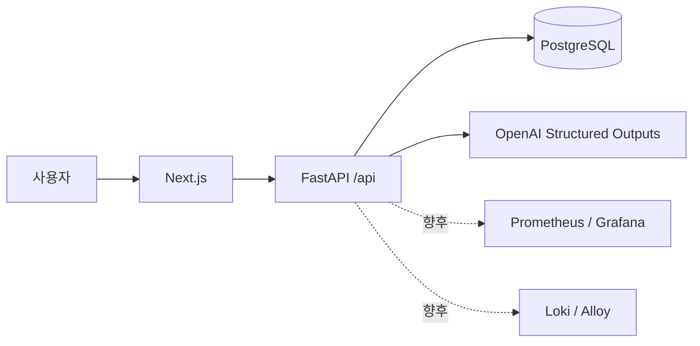

# AI 라이프로그 아키텍처

## 목표와 단계

자연어 입력을 독립적인 기록으로 분리하고, 기존 카테고리를 재사용하거나 생성해
시간순으로 조회하는 개인용 서비스다. 현재 API·DB·AI 분류·Next.js UI와 운영 배포 구성을 구현했다.

1. FastAPI, PostgreSQL, Alembic, 수동 입력 CRUD, Docker Compose, 통합 테스트.
2. OpenAI Structured Outputs + Pydantic 검증, 여러 기록 분리, 일괄 저장.
3. Next.js 입력 화면, 타임라인, 카테고리 필터, 카드와 상세 화면.
4. frontend/backend/PostgreSQL Kubernetes 구성. 이후 주간/월간 요약과 관제는 확장 단계다.

현재 전체 운영 배포 기반은 **OpenStack Kubernetes/containerd/Cilium**에서
실행하며 **Podman**으로 OCI 이미지를 빌드한다. [운영 배포 문서](kubernetes-deployment.md)를 따른다.
Docker Compose는 개발·통합 테스트 용도로만 사용한다.

## 전체 구조



OpenAI 키는 백엔드 환경변수로만 전달한다. 프론트엔드에는 키를 전달하지 않는다.
`/api/entries/parse`가 기존 카테고리와 입력을 전달해 구조화된 후보 목록을
반환한다. Pydantic으로 항목 수, 문자열 길이, 중요도, 날짜 등을 검증한다.
사용자 확인 뒤 `/api/entries/batch`에서 하나의 트랜잭션으로 저장한다.
AI 출력은 신뢰하지 않으며 검증 실패 시 저장하지 않는다.

## 데이터 설계

- `categories`: UUID `id`, 고유한 `name`, UTC `created_at`.
- `entries`: UUID `id`, UTC `created_at`와 `occurred_at`, `raw_text`,
  FK `category_id`, `subcategory`, `title`, `summary`, JSONB 문자열 배열 `tags`,
  1~5 범위 `importance`(기본값 3).
- API의 `category`는 관계를 통해 카테고리 이름을 반환한다. 중복된 이름을 기록 테이블에
  저장하지 않는다. 같은 이름은 공백 제거 후 재사용한다(대소문자는 구별한다).
- 카테고리는 기록 생성/수정 때 PostgreSQL upsert로 생성/재사용한다.
  동시 요청에서도 고유 제약으로 중복을 막는다.
- 카테고리 삭제는 현재 제공하지 않는다. 기록을 지워도 카테고리는 유지된다.
- `(occurred_at, id)` 및 `(category_id, occurred_at, id)` 인덱스가 타임라인 조회를 지원한다.
- 주간/월간 요약은 추후 기간과 생성 이력을 갖는 별도 테이블로 확장한다.

`occurred_at`은 실제 사건 시각, `created_at`은 저장 시각이다. 사건 시각을 생략하면
현재 UTC 시각을 사용한다. 시간대 없는 시각은 거절하며, 한국 시각은 `+09:00`을 붙인다.
프론트엔드가 표시할 때 사용자의 시간대로 변환한다.

## 디렉터리

```text
gptproject/
├── backend/
│   ├── app/               # 설정, DB, 모델, 스키마, API
│   ├── alembic/versions/  # 명시적인 DB 변경 이력
│   ├── tests/             # PostgreSQL 통합 테스트
│   ├── pyproject.toml
│   ├── requirements*.txt  # 고정된 의존성
│   └── Dockerfile
├── frontend/              # Next.js UI, 인증, API 프록시, production 이미지
├── k8s/                   # 단계별 운영 매니페스트 (platform/db/migration/backend 등)
├── scripts/render-k8s.py   # GHCR image, PVC/emptyDir, NodePort/Ingress 선택
├── docs/
├── .env.example
└── docker-compose.yml
```

## API

| 메서드 | 경로 | 동작 |
| --- | --- | --- |
| POST | `/api/entries` | 검증된 기록 하나 저장, 카테고리 재사용/생성 |
| POST | `/api/entries/parse` | OpenAI structured JSON 검증 후 후보 반환, 저장 없음 |
| POST | `/api/entries/batch` | 1~20개 후보를 하나의 트랜잭션으로 저장 |
| GET | `/api/entries` | 사건 시각 내림차순, 카테고리/기간 필터, 페이지 |
| GET | `/api/entries/{id}` | 기록 상세 |
| PATCH | `/api/entries/{id}` | 제공한 필드 수정 |
| DELETE | `/api/entries/{id}` | 기록 삭제 |
| GET | `/api/categories` | 카테고리 목록 |
| GET | `/health/live` | 프로세스 생존 확인 |
| GET | `/health/ready` | DB 연결과 마이그레이션 테이블 확인 |

타임라인 필터는 `category_id`, `from_at`(포함), `to_at`(미포함),
`limit`(1~100, 기본 20), `offset`(0 이상)을 사용한다. 응답은 `items`, `total`,
`limit`, `offset`이다. 동률은 UUID 내림차순으로 정렬한다.
기간 경계로 일/주/월 조회를 지원한다. offset 페이지는 대량 기록에서 향후 커서 방식으로 확장한다.

## 실행·운영 경계

개발·테스트 Compose는 PostgreSQL healthcheck와 migration 성공 후 백엔드를 시작한다.
운영 Kubernetes는 PostgreSQL 준비 → Alembic Job 완료 → backend/frontend rollout
순서로 배포한다. API worker는 테이블을 자동 생성하지 않는다. 운영 데이터는 PVC에 보존한다.
StorageClass 없는 환경에서는 local PV 예시를 사용하고, 테스트만 명시적으로 emptyDir를 선택한다.
Podman과 containerd는 GHCR 이미지를 통해 연결된다. 기본 latest에는 Always pull과 rollout restart가 필요하다.

프론트엔드의 Basic 인증이 페이지와 같은 origin의 /api 프록시를 보호한다.
백엔드는 내부 ClusterIP이며 OpenAI 키는 backend Secret에만 주입한다.
NodePort HTTP는 접속 IP를 제한한 테스트용이다. 개인 기록의 외부 운영에는 TLS를 사용한다.
CORS는 환경변수의 명시적 origin 목록만 허용하며 인증 기능을 대신하지 않는다.
운영에서는 별도 Secret과 비밀번호를 사용한다. 기본 외부 서비스는 frontend NodePort이며
선택적 Cilium Ingress는 TLS 준비 후 frontend로 연결한다. PostgreSQL은 단일 replica로
HA가 아니며 백업·복원 절차가 필요하다.
