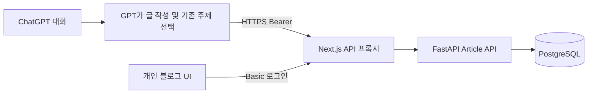

# AutoLog 개인 기술 블로그 아키텍처

## 유지한 구조와 변경점

FastAPI/SQLAlchemy/Alembic/PostgreSQL, Category, Bearer 인증, 웹 Basic 로그인,
Next.js standalone 이미지, Podman/GHCR 빌드와 containerd/Cilium Kubernetes 배포를 유지한다.
Article 중심으로 모델과 UI를 확장한다. 기존 Entry/ingest API와 데이터는 보존하고 UI를 /legacy로 옮긴다.

Article 경로는 AI provider를 호출하지 않는다. 선택적 이전 Entry 분류 모듈 app/ai.py는 별도로 유지한다.
외부 API의 Bearer를 그대로 전달하고 웹 요청에만 서버 Secret의 API_TOKEN을 주입한다.
브라우저는 토큰을 받지 않는다. 공개 Action schema와 health만 인증 없이 접근 가능하다.

## Article 데이터

- UUID id, title, 고유 slug, category_id FK, subcategory, summary, 핵심 content_markdown.
- JSONB tags, UTC created_at/updated_at, source_type, nullable source_reference, draft/published status.
- related_articles는 article_links의 자기참조 FK로 표현한다. 존재하는 글만 연결하며 자기 참조는 거절한다.
  글 삭제 시 해당 관련 링크만 CASCADE 정리하고 다른 글은 보존한다. 링크는 방향이 있다.
- Category는 Entry와 공유한다. 정확한 이름(공백 제거)을 고유 제약과 PostgreSQL upsert로 재사용한다.
- 목록에는 요약만 반환하며 본문은 상세 API에서 읽는다. 제목/요약/본문 ILIKE 검색과 태그/카테고리/상태 필터를 지원한다.
- 수정 시 updated_at을 갱신한다. expected_updated_at을 전달한 수정은 stale version을 409로 차단한다.
- 상태는 개인 소유자의 초안/완성 구분이다. 공개 발행이나 사용자별 권한 분리는 추가 범위다.

## upsert와 동시성

같은 slug 또는 명시적 target_article_id를 기준으로 생성/갱신한다. 관련성 판단은 GPT가
검색과 상세 조회 후 수행한다. 자동 fuzzy matching으로 임의의 글을 덮어쓰지 않는다.
replace는 본문 교체, append는 Markdown 이어쓰기다. 생략한 선택 메타데이터는 기존 값을 유지한다.
append의 태그/관련 링크는 합치며 병합 후 길이도 검증한다.
동일 slug 생성에는 transaction advisory lock, 기존 글 갱신에는 row lock을 사용한다.
DB 실패는 rollback하며 응답 불확실 시 자동 append 재시도를 피한다.

## UI와 안전한 Markdown

메인 목록, 검색/카테고리/태그/상태 필터, /articles/UUID 상세, /articles/new 작성,
/articles/UUID/edit 수정 화면이 있다. react-markdown + remark-gfm으로 목록·표·인용·fenced code를 렌더링한다.
raw HTML은 skipHtml로 제거하고 안전하지 않은 URL scheme도 renderer가 차단한다. dangerouslySetInnerHTML을 사용하지 않는다.
상세 페이지는 관련 글을 링크로 표시한다. 편집은 전체 Markdown 미리보기와 optimistic version을 사용한다.
목록/상세는 보이는 동안 3초마다 재조회하며 편집 중에는 입력을 자동 덮어쓰지 않는다.

## migration과 운영

0001의 Entry/Category 뒤에 0002가 Article과 관계 테이블을 추가한다. 기존 Entry를 삭제하거나 자동 변환하지 않는다.
Alembic upgrade/check로 schema를 확인하고 migration Job 완료 후 API/UI를 rollout한다.
backend readiness는 entries/categories/articles 테이블과 API_TOKEN 설정을 확인한다.
frontend readiness는 DB 준비와 backend 토큰 일치를 전체 2.5초 내 확인한다.

PostgreSQL은 PVC 기본, StorageClass 미구성 시 local PV 예시, 테스트 전용 emptyDir 옵션을 사용한다.
서비스는 frontend NodePort 기본, ChatGPT Action에는 선택적 TLS Ingress와 외부 HTTPS 도메인이 필요하다.
기존 README의 Secret/ConfigMap/보안그룹/백업/롤백 절차를 그대로 사용한다. DB는 단일 replica다.

## 파일

- backend/app/articles.py, article_schemas.py, models.py: 저장·검색·관계·검증.
- backend/alembic/versions/0002_articles.py, tests/test_articles.py: migration과 회귀/동시성 검사.
- frontend/app/page.tsx, app/articles/, components/: 블로그·편집·Markdown.
- frontend/app/legacy/: 이전 Entry 화면.
- docs/actions.openapi.json, chatgpt-actions.md, examples/nfs-article.json: Action 계약과 acceptance 예제.
- scripts/submit-article.py: 비밀 값을 출력하지 않는 API 제출 예제.
